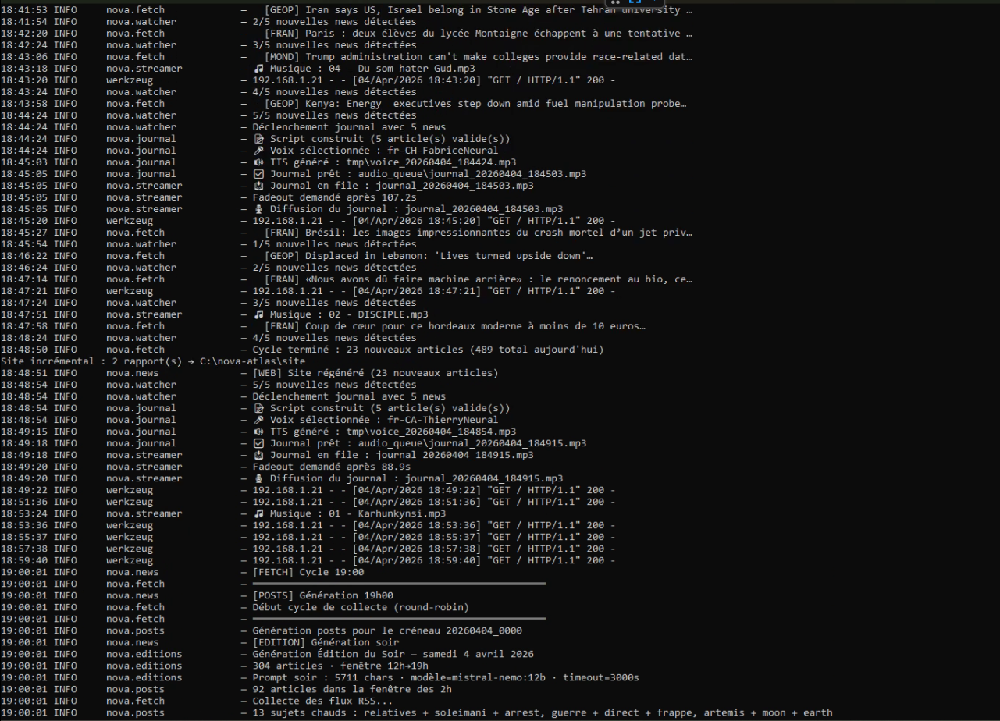

# Nova-Atlas

Nova-Atlas is a fully autonomous AI-powered news engine and internet radio station.
It collects news from dozens of RSS feeds, analyzes them using local LLMs (Ollama or llama-server), and generates high-quality spoken bulletins, written editions, daily reports, social media posts, and a modern static website — all running locally.

---

## Features

### AI News Radio (24/7)
- Real-time detection of new articles
- Automatic generation of spoken radio bulletins (edge-tts + background music mixing)
- Continuous streaming to Icecast with a single permanent ffmpeg process
- Intelligent fade and intro music before each bulletin

### Rich Content Generation
- Daily Narrative Report at 23:00 — long-form journalistic summary
- Timed Editions : Morning (06:00), Midday (12:00), Evening (19:00)
- Social Media Posts: 4 optimized posts every 2 hours
- Live News Feed with category filtering and breaking news ticker

### Modern Web Experience
- Responsive static website with dark/light mode
- Integrated persistent radio player
- Archives of reports and editions
- Web-based configuration interface

---

## LLM Backends

Nova-Atlas supports two LLM backends, configurable in `config/config.yaml` under `llm.provider`:

### llama-server (recommended for production / GPU)
Uses the llama.cpp HTTP API. Better suited for dedicated GPU machines.
```yaml
llm:
  provider: "llama-server"
  model: "/path/to/model.gguf"
  base_url: "http://localhost:8080"   # or your GPU server's IP
  timeout_fetch: 240
  timeout_report: 600
  timeout_edition: 900
```

Start llama-server yourself:
```bash
llama-server -m /path/to/model.gguf --host 0.0.0.0 --port 8080 -c 8192 -t 16
```

Nova-Atlas can also auto-start llama-server if the binary is in your PATH.

### Ollama CLI (convenient for development)
Uses `ollama run` interactively. Fine for dev on a laptop CPU, but slower for production volumes.
```yaml
llm:
  provider: "ollama"
  model: "mistral:7b"
  base_url: "http://localhost:11434"
```

---

## Screenshots

### Web Interface (Live Feed + Radio Player)


(Live news feed with category filters, breaking news banner, and integrated radio player)

### Console Output (News Engine + Radio)


(Example of the rich console logging during operation)


---

## How It Works

Nova-Atlas is built around a modular architecture orchestrated by `main.py`.

### 1. News Engine (NewsEngine process)

- `atlas_fetch.py` periodically collects articles from a wide range of RSS sources (geopolitics, economy, tech, crypto, science, etc.).
- Content is extracted, deduplicated using hashes, and summarized using the configured LLM backend (Ollama CLI or llama-server HTTP).
- Articles are stored as daily JSON files in `data/articles/`.
- Additional tasks include generating social posts, daily reports, and timed editions on a precise schedule.

### 2. Radio Pipeline (Radio process)
- `news_watcher.py` continuously monitors the latest articles JSON and detects new valid summaries.
- When enough new articles are available, it triggers `journal_builder.py`:
  - Loads custom intros/transitions/outros from `messages.yaml`
  - Builds a natural-sounding script
  - Converts text to speech using **edge-tts** (random voice from configured list)
  - Mixes the voice with background music using **ffmpeg**
  - Places the finished MP3 in `audio_queue/`
  - `streamer.py` runs a single permanent ffmpeg process connected to Icecast:
  - Plays music from the `music/` library in a loop
  - Inserts bulletins from the queue with fade logic
  - Maintains a heartbeat with silence to keep the stream alive

### 3. Web Layer (WebServer process)

  - `atlas_web.py` generates a static website on demand (incremental or full rebuild).

- The site includes:
  - Live chronological feed with client-side filtering
  - Report and edition pages rendered from Markdown
  - Persistent radio player (iframe-based to survive navigation)
  - Configuration interface
- A lightweight Flask server serves the site in development mode.

### 4. Orchestration & Resilience
- `main.py` uses multiprocessing to run the three main services independently.
- Supports hot config reload (via flag file or `/config/restart` endpoint).
- Includes a watchdog that restarts crashed processes.
- LLM calls are protected by a smart file-based lock with priority system to avoid conflicts.

All components communicate through the filesystem (`data/`, `audio_queue/`, `site/`), making the system robust and easy to monitor.

---

## Project Structure

```bash
nova-atlas/
├── main.py
├── config/
│   ├── config.yaml
│   └── messages.yaml
├── data/
│   ├── articles/
│   ├── reports/
│   ├── editions/
│   ├── posts/
│   └── atlas_config.json
├── audio_queue/
├── background_music/
├── music/
├── site/                     # Generated static website
├── modules/
│   ├── core/                 # Config + LLM client (Ollama / llama-server)
│   ├── fetch/
│   ├── radio/                # NewsWatcher + JournalBuilder + Streamer
│   ├── report/
│   ├── editions/
│   ├── posts/
│   └── web/
└── requirements.txt
```

---

## Prerequisites

- Python 3.11+
- Ollama **or** llama-server installed and running
- Icecast server
- ffmpeg

### Ollama CLI
```bash
# Install
curl -fsSL https://ollama.com/install.sh | sh
# Pull a model
ollama pull mistral:7b
# Start server
ollama serve
```

### llama-server (llama.cpp)
```bash
# Build from source
git clone https://github.com/ggml-org/llama.cpp.git
cd llama.cpp/build
cmake .. -DLLAMA_BUILD_SERVER=ON -DLLAMA_ACCELERATE=on
cmake --build . --config Release
# Run
./bin/llama-server -m /path/to/model.gguf --host 0.0.0.0 --port 8080 -c 8192 -t 16
```

### Icecast
```bash
sudo apt install icecast2
# Edit /etc/icecast2/icecast.xml to set passwords
sudo service icecast2 start
```

### ffmpeg
```bash
sudo apt install ffmpeg
```

---

## Installation

```bash
git clone https://github.com/nikodindon/Nova-Atlas.git
cd Nova-Atlas
pip install -r requirements.txt
cp config/config.yaml.example config/config.yaml
```

> **Note:** `requirements.txt` installs all Python dependencies. For non-Python tools (ollama/llama-server, icecast, ffmpeg), see the Prerequisites section above.

Edit `config/config.yaml`:
- Set `llm.provider` to `ollama` or `llama-server`
- Set `llm.model` to your model name or GGUF path
- Set `llm.base_url` for llama-server (default: `http://localhost:8080`)
- Configure your language, Icecast credentials, and TTS voices

---

## Running the system

```bash
# Full stack
python main.py --all

# Individual components
python main.py --news
python main.py --radio
python main.py --web
```

See the Commands section below for one-shot operations.

---

## Available Commands

| Command | Description |
|---|---|
| `--all` | Start News Engine + Radio + Web |
| `--news` | News collection, editions, reports & posts |
| `--radio` | Radio streaming only |
| `--web` | Web server only |
| `--fetch` | Run one RSS fetch cycle |
| `--edition [matin\|midi\|soir]` | Generate a timed edition |
| `--report` | Generate daily narrative report |
| `--build` | Rebuild full static website |
| `--cleanup` | Remove invalid articles |

---

## Technology Stack

- **LLM**: Ollama (CLI) **or** llama-server (llama.cpp HTTP API)
- **TTS**: edge-tts
- **Audio Processing**: ffmpeg
- **Streaming**: Icecast
- **Web**: Flask + Jinja2 + custom modern CSS
- **Parsing**: BeautifulSoup4 + lxml + requests

---

## Roadmap

- [ ] Complete multi-language support for radio messages
- [ ] Improved cross-fade between music and bulletins
- [ ] Optional local TTS backend (e.g. Piper)
- [ ] Unified path management across all modules
- [ ] Docker / docker-compose support
- [ ] Enhanced admin dashboard

---

## License

MIT License
